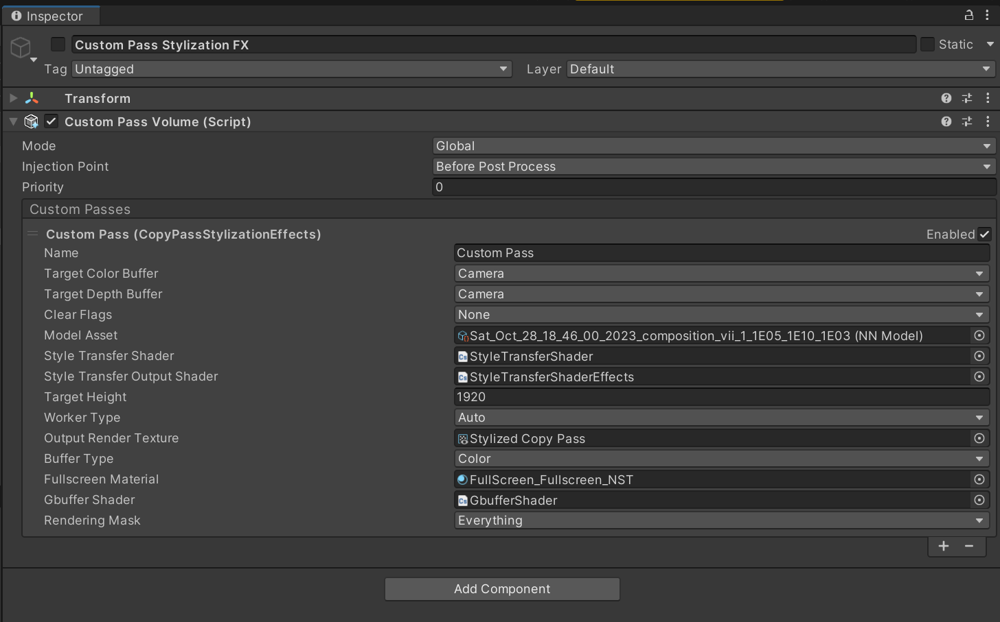

# Towards Real-time G-buffer-Guided Style Transfer in Computer Games

This repository contains the implementation of the paper ["Towards Real-time G-buffer-Guided Style Transfer in Computer Games"](https://ieeexplore.ieee.org/abstract/document/10458434/) published in IEEE Transactions on Games. The paper presents an approach that uses the G-buffer information available in a game pipeline to generate robust and temporally consistent in-game artistic stylizations based on a style reference image.

## Overview of the Code

The code is organized into the following directories:

* `depth-aware-nst`: Contains the implementation of the style transfer network.
* `saved_models`: Saved models for the style transfer network. This are also provided in ONNX format for use in games.
* `Unity`: Includes scripts for integrating the style transfer network into a Unity project.


## Depth-aware Stylisation Network
### Setup
* Python 3.8
* [PyTorch](http://pytorch.org/) 2.0.1+cu117
* [Kornia](https://kornia.readthedocs.io/) 0.6.12
* [ONNX](https://onnx.ai/) 1.14.0
* [ONNX Runtime](https://onnxruntime.ai/) 1.15.1


### Usage
Stylize image
```
python depth-aware-nst/fast_neural_style.py eval --content-image </path/to/content/image> --model </path/to/saved/model> --output-image </path/to/output/image> --cuda 0
```
* `--content-image`: path to content image you want to stylize.
* `--model`: saved model to be used for stylizing the image (eg: `starry_night.pth`)
* `--output-image`: path for saving the output image.
* `--content-scale`: factor for scaling down the content image if memory is an issue (eg: value of 2 will halve the height and width of content-image)
* `--cuda`: set it to 1 for running on GPU, 0 for CPU.

Train model
```bash
python depth-aware-nst/fast_neural_style_fusion.py train --dataset </path/to/train-dataset> --style-image </path/to/style/image> --save-model-dir </path/to/save-model/folder> --epochs 2 --cuda 1
```

There are several command line arguments, the important ones are listed below:
* `--style-image`: path to style-image.
* `--save-model-dir`: path to folder where trained model will be saved.
* `--cuda`: set it to 1 for running on GPU, 0 for CPU.
* `--content-weight`: weight for content-loss, default is 1e5.
* `--style-weight`: weight for style-loss, default is 1e10.
* `--depth-loss`: set it to 1 to train with depth loss, 0 train without depth loss, default is 1.
* `--depth-weight`: weight for depth-loss, default is 1e5

## Injecting NST in a Computer Game
### Setup
* Unity 2021.3.25f1
* [High Definition RP 12.1.11](https://docs.unity3d.com/Packages/com.unity.render-pipelines.high-definition@12.1/manual/index.html)
* [Barracuda 3.0.0](https://docs.unity3d.com/Packages/com.unity.barracuda@3.0/manual/index.html)



* Create an empty GameObject in the scene
* Add a Custom Pass Volume
* Add the `CopyPassStylizationEffects` pass
* Fill in the missing assets (drag & drop)
    * Model Asset: The trained stylisation network exported to .onnx format
    * Style Transfer Shader: `StyleTransferShader.compute`
    * Style Transfer Output Shader: `StyleTransferShaderEffects.compute`
    * Output Render Texture: `Stylized Copy Pass.renderTexture`
    * Fullscreen Material: `FullScreen_Fullscreen_NST.mat`
    * Gbuffer Shader: `GbufferShader.compute` (This should be located at the `Resources` directory in the project's Assets folder)
    
When setting this Gameobject active in the scene, the stylization effect takes place.