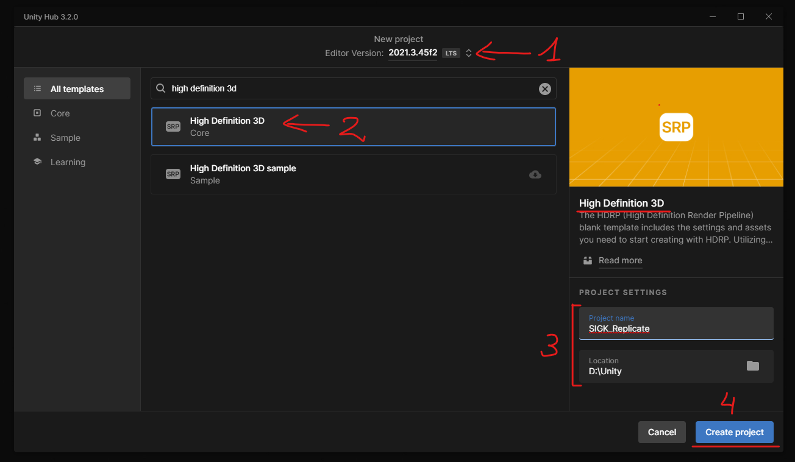
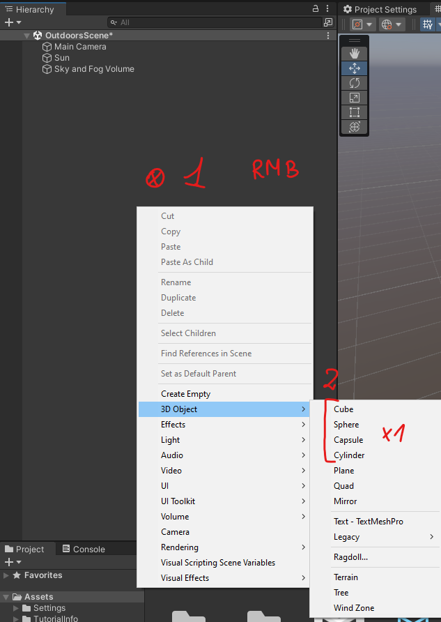
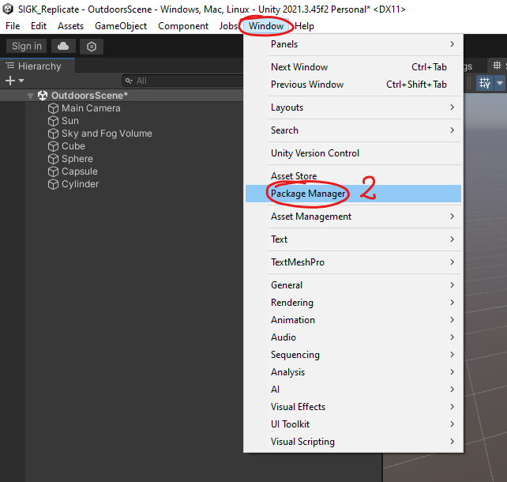
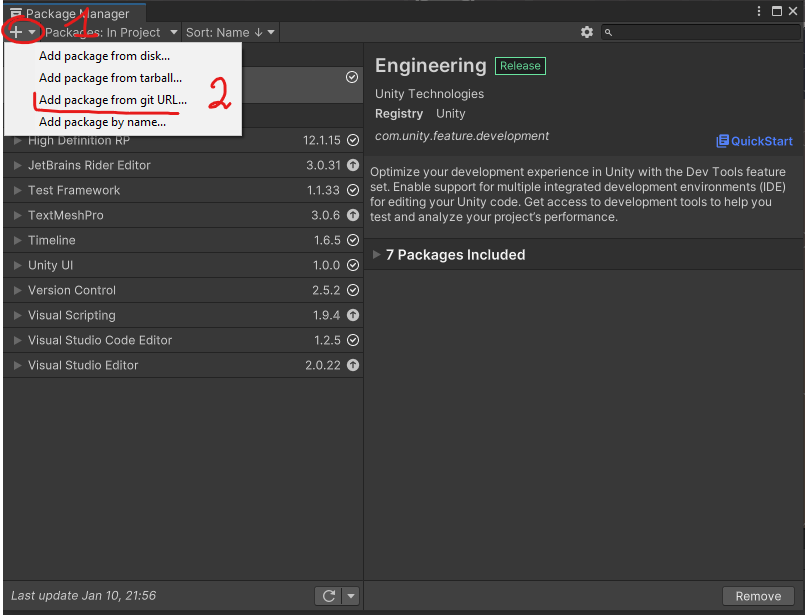
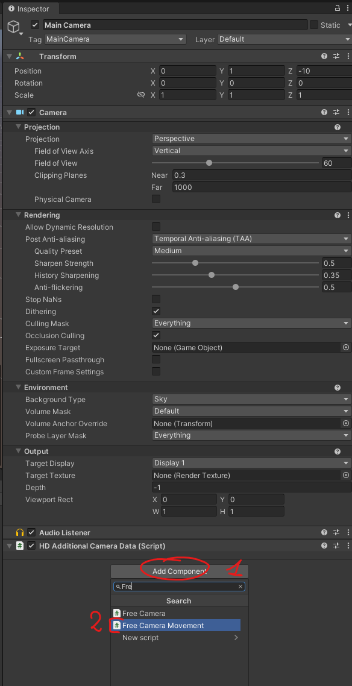
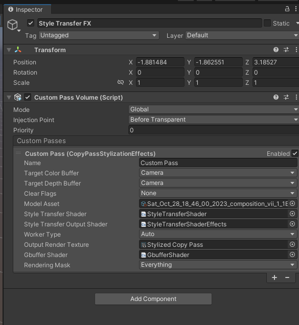
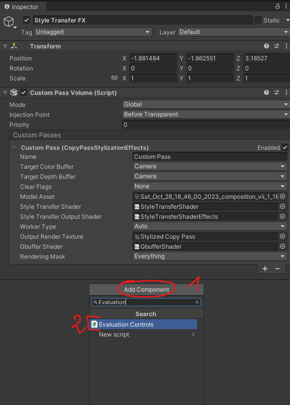
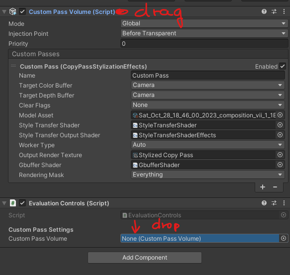

## Project Creation


## Scene
### Add some objects to scene


### Install Barracuda
```
https://github.com/Unity-Technologies/barracuda-release.git
```



### Drop GBGST
Copy content of GBGST archive to Assets/GBGST

### Add Controls to "Main Camera"
1. Open "Main Camera" in Inspector (left click).
2. Add Component "FreeCameraMovement"



### Run Game & Test
Controls (movement):
- WSAD: forward, backward, left, right
- Q: down
- E: up
- mouse: pitch & yaw

### Create Style Transfer FX Object
1. Create empty GameObject
  - right click in Hierarchy
  - "Create Empty"
2. Add "Custom Pass Volume" component to GameObject
3. Add "CopyPassStylizationEffects" to Custom Passes
4. Configure CustomPassStylizationEffects



### Add Controls To Style Transfer FX
1. Add Component "Evaluation Controls"



2. Drag "Custom Pass Volume" from GameObject into "Custom Pass Volume" property in Evaluation Controls Script



### Run Game & Test
Controls (Style)
- R: take screenshot
- F: increment counter
- C: change mode: normal / stylized

Screenshot is saved to project directory eg. `D:/Unity/SIGKNet/Evaluation`, where `D:/Unity/SIGKNet` is project directory.

Screenshot as `<counter>/<mode>.png`, where:
- `<counter>` is current counter value
- `<mode>` is `false` when stylization is off, otherwise `on`.